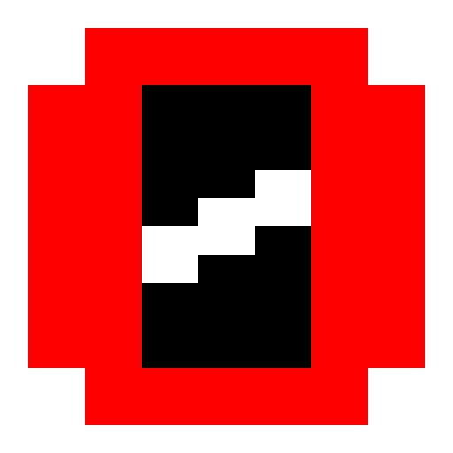

# orion

Gemini/Spartan client in Electron.

## Features

 - [x] Can make gemini requests
     - [x] Handle 1x status codes
     - [ ] Handle client certificates
 - [x] Can make spartan requests
     - [ ] Handle spartan input links
 - [x] Render gemtext
     - [x] Basic line types
         - [x] Preformatted alt text
     - [x] Advanced line types
     - [ ] Correctly render spartan input links
 - [ ] Top menu
 - [ ] Bookmarks
 - [ ] Config screen
 - [ ] Custom CSS theming (for UI and pages)
     - [ ] Per-capsule theming?
